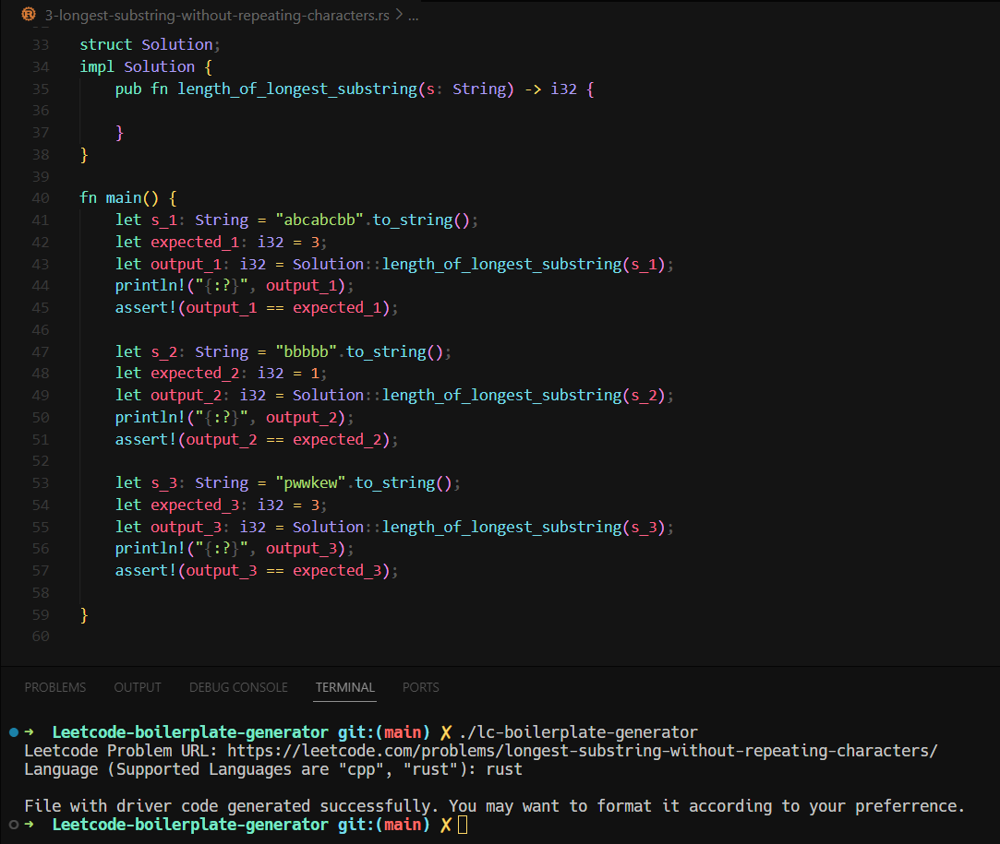
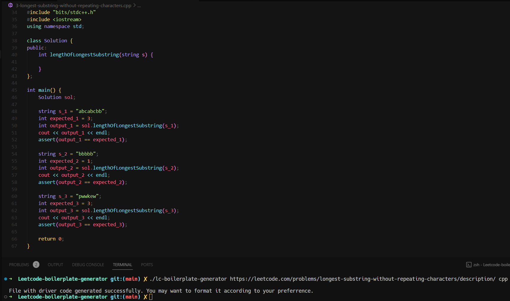

# Leetcode Boilerplate Generator

Ever had to debug Leetcode problems? Leetcode has debugging behind their paywall. Running & Debugging a Leetcode problem requires you to write the driver code that will call the problem function with example inputs & outputs, `lc-boilerplate-generator` can do just that for you.
This can generate compilable driver code in C++ & Rust with example inputs and assertions against their expected outputs.

[Demo problem link](https://leetcode.com/problems/longest-substring-without-repeating-characters/description/)

## How to Use

- `./lc-boilerplate-generator <leetcode-problem-url> <language>` (supported languages: `cpp`, `rust`, `java`, `python3`)
Or
- `./lc-boilerplate-generator` and it will ask for both these input.

## Setup

- Install Rust from [https://rustup.rs/](https://rustup.rs/)
- Run with `cargo run` or Build binary with `cargo build --release`

## TODO

- [ ] Support Java and Python with full driver code
- [ ] Handle problems where return type is void & the problem checks the updated version of the input, e.g. [this LC Problem](https://leetcode.com/problems/rotate-array)
